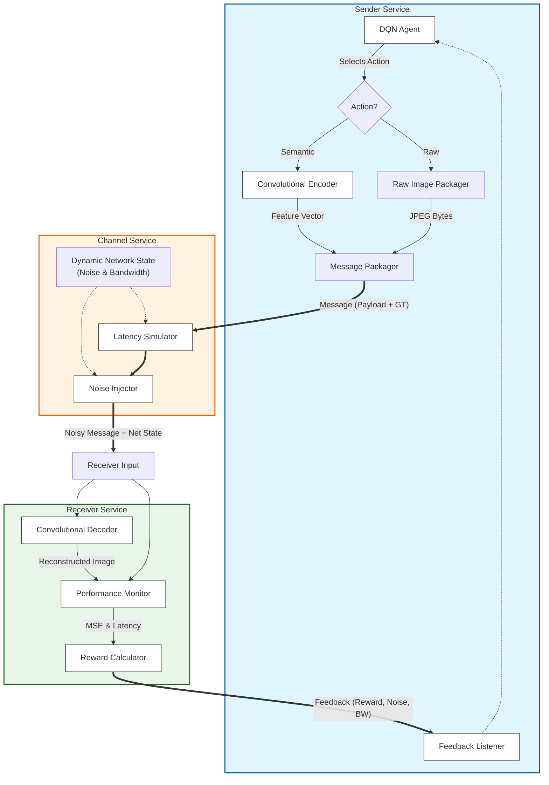

# Adaptive Semantic Communication with Deep Reinforcement Learning

This project is a Docker-based emulation of a dynamic semantic communication system.

The core of the project is a Deep Reinforcement Learning (DRL) agent (living in the **Sender**) that learns an optimal policy for data transmission. It decides whether to send a compact **semantic vector** (fast but lossy) or the **raw image data** (slow but perfect) based on real-time local resource (CPU, memory) and network (noise, bandwidth) conditions.

---

## System Architecture



### Component Interaction Flow

1.  **Sender**: The DQN Agent observes the current state (local resources + last known network state) and selects an action (Semantic vs. Raw).
    *   **Semantic**: Image is passed through the **Encoder** to produce a compressed feature vector.
    *   **Raw**: Image is sent as raw JPEG bytes.
2.  **Channel**: Simulates the network environment.
    *   **Latency**: Delays the message based on simulated bandwidth and message size.
    *   **Noise**: Adds Gaussian noise to the message payload (if Semantic) based on simulated noise levels.
    *   **State Injection**: Appends the true network state (Noise, Bandwidth) to the message for the Receiver.
3.  **Receiver**: Reconstructs the image and evaluates performance.
    *   **Decoding**: Uses the **Decoder** to reconstruct the image from the (noisy) vector.
    *   **Evaluation**: Compares the reconstructed image to the Ground Truth (GT) to calculate Reconstruction Loss (MSE).
    *   **Reward**: Computes a reward based on MSE and Latency.
4.  **Feedback**: The Receiver sends the computed Reward and the observed Network State back to the Sender's **Feedback Listener**, closing the RL loop.

---

## Core Components

The system is emulated using three interconnected Docker containers:

### 1. `Sender` (The DRL Agent)
* **Role:** The "brain" of the operation.
* **Agent:** A DQN (Deep Q-Network) agent from `stable-baselines3`.
* **State ($S_t$):** A 5-dimensional vector:
    1.  `cpu_load` (local)
    2.  `memory_load` (local)
    3.  `data_size_to_send` (task)
    4.  `last_noise_level` (from network)
    5.  `last_bandwidth` (from network)
* **Actions ($A_t$):** A discrete choice:
    * `Action 0: Semantic Transfer`: Sends the 512-element feature vector (`b"SEM"`).
    * `Action 1: Raw Transfer`: Sends the full raw image file (`b"RAW"`).
* **Learning:** Receives a `reward` package from the `Receiver` via a dedicated feedback socket and trains its policy.

### 2. `Channel` (The Dynamic Environment)
* **Role:** Simulates a realistic, fluctuating network.
* **Dynamic State:** Runs a separate thread that continuously changes two values:
    1.  `current_noise`: The noise level to be applied to semantic vectors.
    2.  `current_bandwidth`: The (simulated) speed of the connection.
* **Logic:**
    1.  Receives a message from the `Sender`.
    2.  Calculates a `time.sleep(delay)` based on message size and `current_bandwidth` to simulate latency.
    3.  If the message is `b"SEM"`, it applies `current_noise` to the vector.
    4.  It prepends the network state (`[noise, bandwidth]`) to the message and forwards it to the `Receiver`.

### 3. `Receiver` (The Reward Calculator)
* **Role:** The "ground truth" that measures performance.
* **Logic:**
    1.  Receives the full message: `[noise] | [bandwidth] | [type] | [timestamp] | [label] | [payload]`.
    2.  **If `b"SEM"`:** Decodes the `noisy_vector` from the payload.
    3.  **If `b"RAW"`:** Decodes the raw image and runs it through the feature extractor to get a "perfect" vector.
    4.  **Calculates Latency:** `total_latency = time.now() - timestamp`.
    5.  **Calculates Semantic Loss:** `semantic_loss = MSE(reconstructed_vector, ground_truth_vector)`.
    6.  **Calculates Reward ($R_t$):** Computes a final reward score based on whether the latency deadline was met and the amount of semantic loss.
    7.  **Sends Feedback:** Sends a full package `[reward, noise, bandwidth]` back to the `Sender` to complete the DRL loop.


---

## How to Run the Emulation

This project is fully containerized. From the root directory (where `docker-compose.yml` is located):

1.  **Build and Run:**
    This command will build all three container images and start the emulation. The `--build` flag forces a rebuild to include any code changes.

    ```bash
    docker-compose up --build
    ```

2.  **Monitor Output:**
    The terminal will show the interleaved logs from all three containers, allowing you to see the agent's decisions, the channel's state changes, and the receiver's reward calculations in real-time.

3.  **Stop the Emulation:**
    Press `Ctrl+C` in the terminal.

---

## Current Project Status (Phase 3)

The project is currently in **Phase 3**. The full DRL feedback loop is implemented, and the environment is **dynamic**. The agent is actively training to develop a policy that adapts to changing CPU, memory, channel noise, and bandwidth conditions.